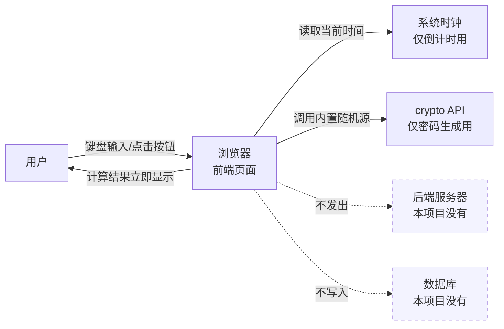

# TECH_DESIGN.md —— 效率小工具箱 · 技术设计

> Day 5 产出 | 项目：my-first-website | 基于：PRD.md（Day 4）· research.md（Day 3）
> 今日不写代码，本文档只定「用什么建、数据怎么流」。

## 1. 技术路线（一句话版）

> **纯前端静态网页：原生 HTML + CSS + JavaScript，三个工具页 + 一个导航首页，无后端、无数据库，所有计算在用户浏览器内完成。**

## 2. 为什么选它（方案比较）

| 方案 | 描述 | 优点 | 缺点 | 结论 |
|---|---|---|---|---|
| **A. 原生 HTML/CSS/JS（选定）** | 每个工具一个 HTML 页面，共用一份样式表 | 零依赖零构建工具；学习成本最低；加载快；GitHub Pages 可直接免费托管 | 工具多到几十个时页面组织会变繁琐 | ✅ **本期采用**：与 PRD「只做 3 个工具、无后端」完全匹配，Day 7 一个新人也能看懂全部代码 |
| B. 前端框架（Vue/React） | 用框架组织单页应用 | 组件化、可扩展；IT-Tools 同款思路 | 需要构建工具链（npm、打包），对 Day 7 的 MVP 是纯负担；学习周期长 | ❌ 本期不用：3 个工具撑不起框架的复杂度，属于「用大炮打蚊子」 |
| C. 前端 + 后端 + 数据库 | 加服务器和存储 | 能做账号、历史记录、云同步 | 与 PRD 的「明确不做」直接冲突；引入部署、运维、成本 | ❌ 永不（现阶段）：PRD 已砍全部需要后端的功能 |

**选型理由总结**：技术路线必须服务于 PRD，而不是反过来。PRD 的三个工具全部是「输入即计算即显示」的纯本地逻辑，且明确砍掉了登录/存储/云同步——所以 A 方案是唯一让 Day 7 按时交付的选择。将来工具数量超过 10 个、或需要新功能时，再评估迁移到 B 方案（届时页面结构已清晰，迁移成本可控）。

## 3. 各工具的技术要点（对应 PRD 验收标准）

| 工具 | 实现要点 | 对应 AC |
|---|---|---|
| 倒计时器 | 记录「结束时刻的时间戳」而非每秒减一，保证切标签页后仍准确；提示音用短音频文件 | AC4–AC9（含 AC8 难点，见开放问题） |
| 单位换算 | 每类换算维护一张「单位 → 基准单位倍率」表，温度用专用公式；换算类型切换时重置表单 | AC10–AC14 |
| 密码生成 | 用浏览器内置的密码学随机源 `crypto.getRandomValues()`（非普通随机数）；字符集按勾选拼接；不发出任何网络请求 | AC15–AC20 |

## 4. 数据流图

**数据从哪来、到哪去（一句话版）**：

> 所有数据都由用户在页面上亲手输入，所有计算都发生在你自己的浏览器里，结果显示后随页面关闭而消失——全程不出你的电脑，无上传、无存储、无第三方。

## 5. 对 PRD 的符合性检查

- ✅ 未引入后端/数据库（PRD「明确不做」第 2 条）
- ✅ 密码生成满足 AC20「不发送任何网络请求」
- ✅ 倒计时方案直接回应 AC8
- ✅ 本文档未写一行实现代码（今日边界）

## 6. 遗留问题（带入开发日）

1. AC7 提示音的自动播放限制（PRD 开放问题 4）——Day 7 测试「切走再切回」，必要时视觉提醒兜底
2. 部署方式候选：GitHub Pages（与仓库同源，零成本）——Day 6/7 确认
